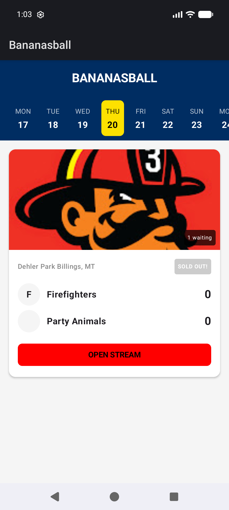

# Bananasball 🍌⚾️

A professional-ish fan app for the **Banana Ball** league, built with **Kotlin Multiplatform** and **Compose Multiplatform**.

## Features

- **Live Schedule**: Scraped directly from the Savannah Bananas official website.
- **Deep Stream Discovery**: Automatically finds and links directly to scheduled or live YouTube streams for games happening today or in the near future.
- **One-Click Watch**: Launches the official YouTube app directly to the stream.
- **Offline First**: All schedule data is cached locally using **Room KMP**.
- **Cross-Platform**: Designed for Android and iPad/iOS.

## Tech Stack

- **UI**: Compose Multiplatform
- **Logic**: Kotlin Multiplatform (KMP)
- **Data**: Room KMP (Persistence), Ktor (Networking)
- **HTML Parsing**: ksoup
- **Image Loading**: Coil 3

## Open Source

This project is licensed under the **Apache License 2.0**. It is a fan-made project and is not affiliated with the official Savannah Bananas or Banana Ball league.

To maintain compliance and respect copyright, this app does not bundle official team logos; it resolves and loads them from public URLs at runtime.
