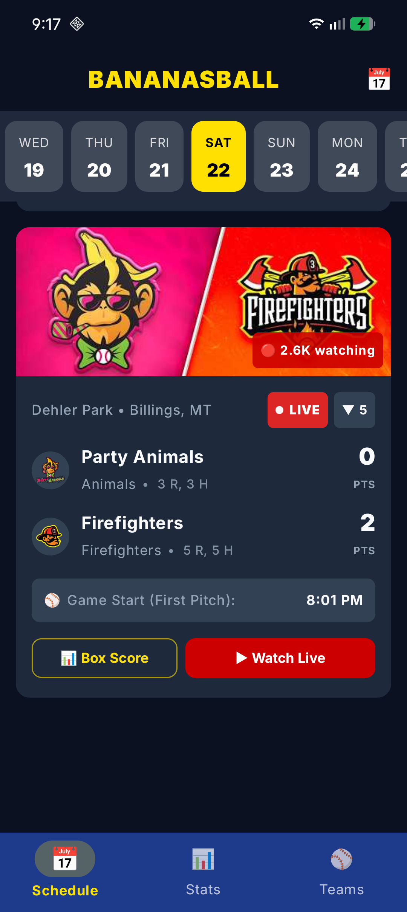
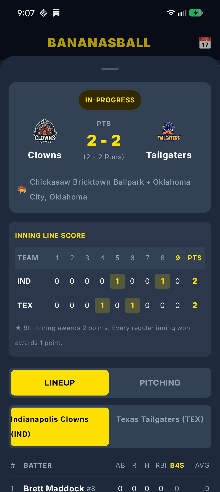
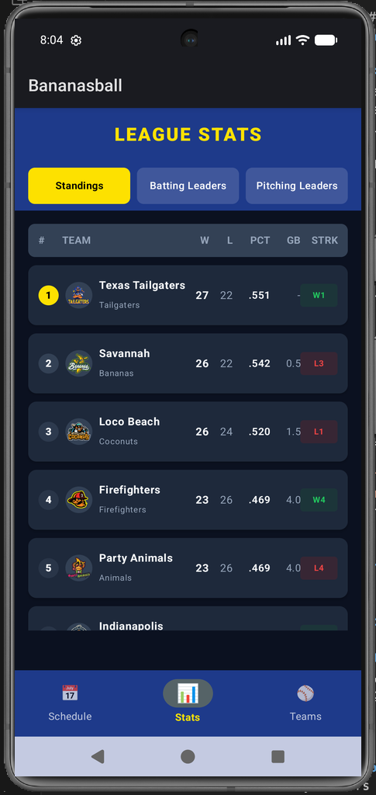
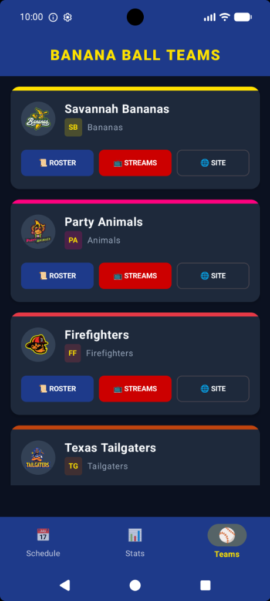

# Bananasball 🍌⚾️

A professional-ish fan app for the **Banana Ball** league, allowing fans to easily follow along with and watch all the yellow ball antics live.

<p align="center">
  <a href="https://github.com/jacobhaynes-swe/Bananasball/releases/latest">
    
  </a>
</p>

<p align="center">
  
  &nbsp;
  
  &nbsp;
  
  &nbsp;
  
</p>

---

## Key Features

### Real-Time Stream Discovery & Live Audiences
- **Deep YouTube Broadcast Discovery**: Automatically scans official team channels (Savannah Bananas, Party Animals, Firefighters, Texas Tailgaters, Indianapolis Clowns, Loco Beach Coconuts) to extract direct livestream watch links and broadcast thumbnails.
- **Dynamic Viewership Badges**: Displays pre-game waiting counters (`🔥 X waiting`) and live audience numbers (`🔴 2.6K watching`) directly on match cards.
- **One-Click Native Launch**: Opens live broadcasts directly in the native YouTube app or web browser with zero navigation friction.

### Live Game Scorecards & Banana Ball Scorebug
- **Banana Ball Point Tracking**: Displays both inning-by-inning points (`PTS`) and cumulative game action (`Runs` & `Hits`).
- **Live Inning Intelligence**: Compact baseball notation (`▲ 3`, `▼ 7`) derived dynamically from line scores and aggregate bullpen innings pitched.
- **Accurate World Tour Ballparks**: Official stadium names and cities resolved directly from Directus (`Busch Stadium • St. Louis, MO`, `Chickasaw Bricktown Ballpark • Oklahoma City, OK`, `Dehler Park • Billings, MT`).
- **Graceful Stats Handling**: Unentered or delayed official stats are handled cleanly with status indicators rather than fabricated 0-0 scores.

### Interactive Gameday View (Box Score Sheet)
- **Inning Line Score Matrix**: Frame-by-frame breakdown of points won per inning, including highlight badges for regular innings (1 pt) and the final inning rule where every run counts as a point.
- **Lineup & Pitching Ledgers**: Expandable player cards showing At-Bats (`AB`), Runs (`R`), Hits (`H`), RBIs, Trick Plays (`B4S`), Batting Average, Innings Pitched (`IP`), Strikeouts (`SO`), and Earned Runs (`ER`).

### Fast Boot & Tiered Sync
- **Sub-200ms Cold Start**: Tiered synchronization loads and displays the base schedule and matchups immediately, then enriches YouTube streams and audience counts asynchronously in the background.
- **Custom Spinning Baseball Loader**: Custom-animated yellow baseball loading spinner and pull-to-refresh indicator across all views.

### Interactive Calendar & Schedule Navigation
- **Dynamic Date Ribbon**: Quick horizontal date picker ribbon to browse adjacent match days.
- **Full Season Calendar**: Material 3 DatePickerDialog to jump to any date across the entire world tour.
- **Adaptive Foreground Polling**: Automatically polls active game days every 45 seconds for real-time scores and stream updates.

### League Standings & Leaderboards
- **Official Directus API Integration**: Live standings tracking Wins, Losses, Win Percentage, Games Back (`GB`), and Streaks (`STRK`).
- **Batting & Pitching Leaders**: Comprehensive leaderboards for Batting Average, Home Runs, RBIs, Stolen Bases, ERA, Strikeouts, and Wins.

### Teams & Media Hub
- Explore all 6 Banana Ball teams, official colors, home venues, and quick links to live streams, rosters, and official team sites.

### Midnight Dark Theme
- Tailored Material 3 dark theme with deep midnight surfaces (`#0B1120`), high-contrast slate cards (`#1E293B`), and Savannah Banana yellow accents (`#FFE000`).

---

## Architecture & Tech Stack

Built following the **Tube / Socket / Grid** architecture for Kotlin Multiplatform:

| Layer | Technologies |
|---|---|
| **UI (Tube)** | Compose Multiplatform, Material 3, Coil 3 (Async Image Loading), Jetpack Lifecycle / ViewModel |
| **Domain (Socket)** | Pure Kotlin Domain Entities, Repository Contracts, Coroutines & Flow |
| **Data Engine (Grid)** | Room KMP (SQLite persistence, migrations), Ktor Client (Content Negotiation, Timeout, Headers), Ksoup (HTML Scraping), Directus REST API |

---

## Installation & Getting Started

### 📲 Sideload APK (No IDE Required)
1. Head over to the **[Releases](https://github.com/jacobhaynes-swe/Bananasball/releases)** page (or click the **Download APK** button above).
2. Download the latest `Bananasball-vX.X.X.apk` directly to your Android device.
3. Tap the downloaded `.apk` file to install (allow *"Install unknown apps"* if prompted).
4. Launch **Bananasball** and enjoy live games!

---

### 💻 Build from Source (Developers)

#### Prerequisites
- Android Studio Ladybug / Meerkat or IntelliJ IDEA with KMP plugin
- JDK 17+
- Android SDK 34+

#### Build & Run
```bash
# Run unit test suite
./gradlew :shared:testAndroidHostTest

# Build and install to connected device/emulator
./gradlew :androidApp:installDebug
```

---

## Open Source & Disclaimer

This project is licensed under the **Apache License 2.0**.

> [!NOTE]
> This is an unofficial, fan-made open-source project and is not affiliated with, endorsed by, or sponsored by Fans First Entertainment, the Savannah Bananas, or the Banana Ball league. Official team logos are resolved and loaded from public URLs at runtime to respect copyright and trademarks.
